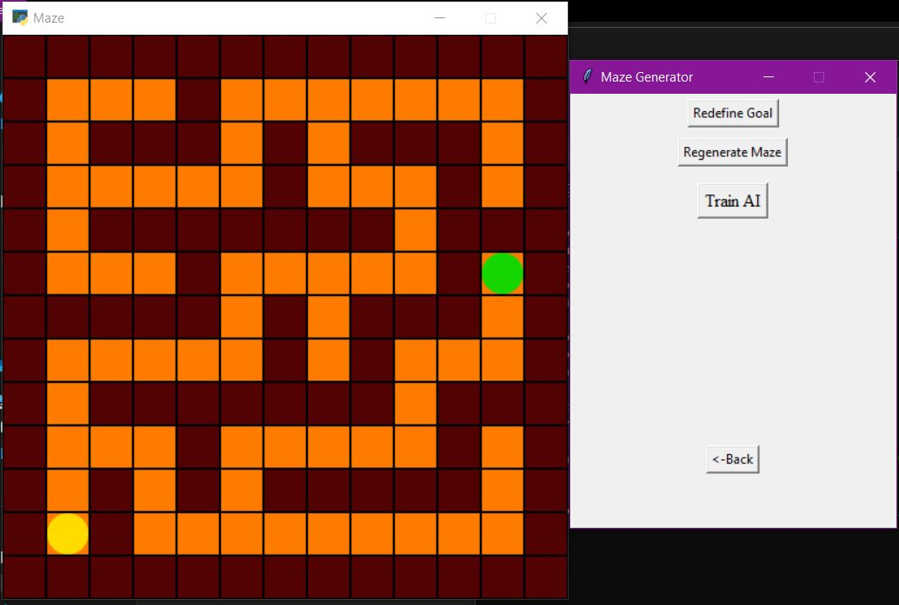

# Maze Q Learning
The AI solves a maze using Q Learning.

You can change the theme of the maze, customize the maze, choose the location of the goal, and experiment with different parameters.

Dependencies:

`pip install pyglet matplotlib numpy`

